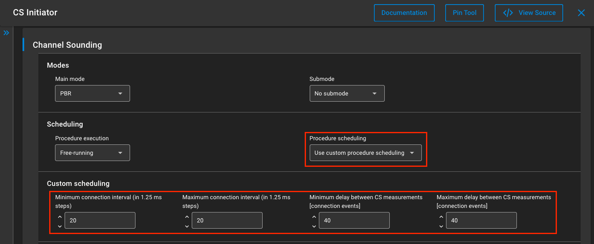
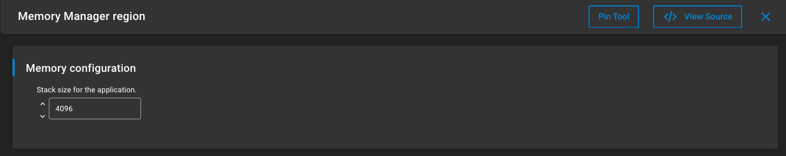
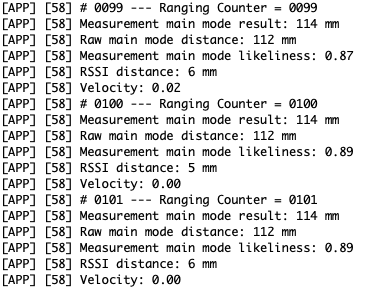
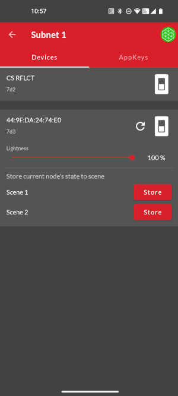

# Mesh & Channel Sounding Examples

## Description ##

These example projects aim to demonstrate the feasibility of a simultaneously running Bluetooth Mesh Stack and Channel Sounding measurement process. It models a Light and Switch Node, which continuously measures the distance between the two of them.

Please, see more about Bluetooth Mesh [here](https://docs.silabs.com/btmesh/latest/btmesh-developers-guide-overview) here and Channel Sounding [here](https://docs.silabs.com/rtl-lib/latest/rtl-lib-channel-sounding-dev-guide).

## Simplicity SDK version ##

SiSDK v2025.6.2

---

## Important

> ⚠ You are not required to follow through with the setup part of the Instructions when using our [*External Repos*](../../README.md) feature!

This project README assumes that the reader is familiar with the usage of SiliconLabs Simplicity Studio 5 and the provided example projects within it.

---

## Requirements

  - Simplicity Studio 5/6 with the latest SiSDK
  - 2x SiliconLabs Boards with Channel Sounding support (for example BRD2606A)

## Known limitations:

  - Simplicity Studio 6 requires manual project setup, as the External Repos feature is not yet supported
  - Both Channel Sounding and Bluetooth Mesh are resource hungry technologies, scale them with care

## Instructions

  - The example contains files for two separate projects, an Initiator/Light and a Reflector/Switch node, placed in the appropriately named folders
  - Create a new project based on the ```Bluetooth - SoC CS Initiator``` example
  - Copy the following files into the root directory of your project, overwriting the already existing ones if needed:
    - initiator_light/src/app.c
  - Install the following components:
    - Platform > Driver > PWM > PWM component, named ```led0```
    - Bluetooth Mesh > Models > Lighting > Lightness Server
    - Bluetooth Mesh > Stack > GATT Provisioning Bearer
    - Bluetooth Mesh > Stack > Models > Proxy Server
  - It is recommended to slow down the Channel Sounding, to make space for the Mesh communication (Bluetooth > Application > Miscellaneous > CS Initiator):

  
  - This will set a custom measurement interval of one second
  - Increase the stack size so the simultaneous CS/Mesh traffic can be handled (Services > Memory Manager > Memory Manager region):

  
  - When everything is configured, build and flash the project

  - Create a new project based on the ```Bluetooth - SoC CS Reflector``` example
  - Copy the following files into the root directory of your project, overwriting the already existing ones if needed:
    - reflector_switch/src/app.c
  - Install the following components:
    - Application > Utility > Button Press
    - Bluetooth Mesh > Models > Lighting > Lightness Client
    - Bluetooth Mesh > Stack > GATT Provisioning Bearer
    - Bluetooth Mesh > Stack > Models > Proxy Server
  - Increase the stack size so the simultaneous CS/Mesh traffic can be handled (```4096``` recommended here, as well)
  - When everything is configured, build and flash the project

  - The devices should quickly find each other and start the CS measurement:

  
  - While the measurements are running, the Nodes can be provisioned into the same network (skipping some measurement cycles) with the Initiator having the functionality of the Light Lightness Server while the Reflector getting Light Lightness Client. After all this, the Light Node can be controlled via the buttons of the Switch Node:

   
